# Client SDK Architecture

## Table of Contents
- [Overview](#overview)
- [Core Architecture](#core-architecture)
- [Component Dependencies](#component-dependencies)
- [Connection Management](#connection-management)
- [Message Processing Pipeline](#message-processing-pipeline)
- [Encryption Architecture](#encryption-architecture)
- [Handler System](#handler-system)
- [Extension Architecture](#extension-architecture)
- [Concurrency Model](#concurrency-model)
- [Error Handling & Recovery](#error-handling--recovery)

## Overview

The Client SDK is a sophisticated Go library for WebSocket communication, featuring automatic reconnection, end-to-end encryption, concurrent message processing, and extensible handler patterns. It's designed for high-performance, secure real-time applications.

## Core Architecture

### High-Level System Architecture

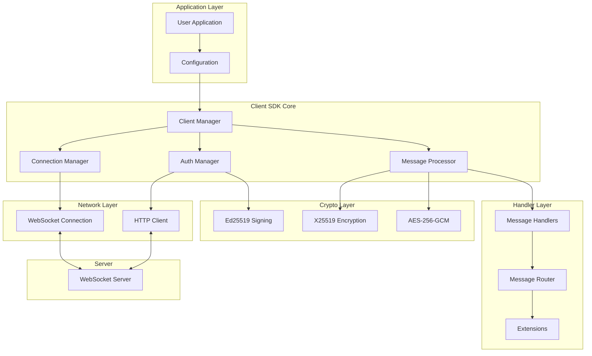
```mermaid
graph TB
    subgraph "Application Layer"
        APP[User Application]
        CFG[Configuration]
    end

    subgraph "Client SDK Core"
        CLIENT[Client Manager]
        AUTH[Auth Manager]
        CONN[Connection Manager]
        MSG[Message Processor]
    end

    subgraph "Handler Layer"
        HANDLERS[Message Handlers]
        ROUTER[Message Router]
        EXT[Extensions]
    end

    subgraph "Crypto Layer"
        ED25519[Ed25519 Signing]
        X25519[X25519 Encryption]
        AES[AES-256-GCM]
    end

    subgraph "Network Layer"
        WS[WebSocket Connection]
        HTTP[HTTP Client]
    end

    subgraph "Server"
        SERVER[WebSocket Server]
    end

    APP --> CFG
    CFG --> CLIENT
    CLIENT --> AUTH
    CLIENT --> CONN
    CLIENT --> MSG
    
    MSG --> HANDLERS
    HANDLERS --> ROUTER
    ROUTER --> EXT
    
    AUTH --> ED25519
    MSG --> X25519
    MSG --> AES
    
    CONN --> WS
    AUTH --> HTTP
    
    WS <--> SERVER
    HTTP <--> SERVER
```

## Component Dependencies

### Detailed Component Dependency Graph

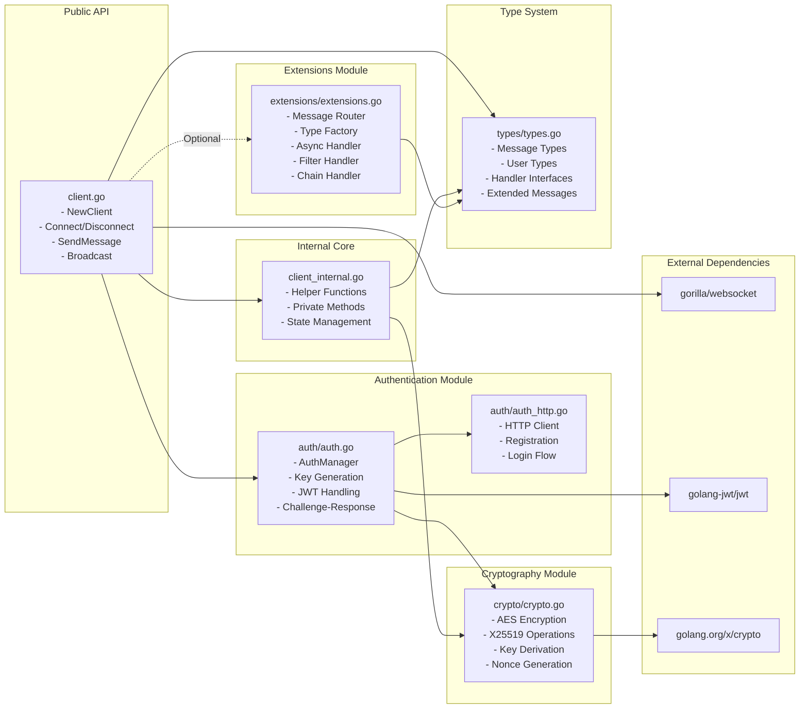
```mermaid
graph LR
    subgraph "Public API"
        CLIENT[client.go<br/>- NewClient<br/>- Connect/Disconnect<br/>- SendMessage<br/>- Broadcast]
    end

    subgraph "Internal Core"
        INTERNAL[client_internal.go<br/>- Helper Functions<br/>- Private Methods<br/>- State Management]
    end

    subgraph "Authentication Module"
        AUTH[auth/auth.go<br/>- AuthManager<br/>- Key Generation<br/>- JWT Handling<br/>- Challenge-Response]
        AUTH_HTTP[auth/auth_http.go<br/>- HTTP Client<br/>- Registration<br/>- Login Flow]
    end

    subgraph "Cryptography Module"
        CRYPTO[crypto/crypto.go<br/>- AES Encryption<br/>- X25519 Operations<br/>- Key Derivation<br/>- Nonce Generation]
    end

    subgraph "Type System"
        TYPES[types/types.go<br/>- Message Types<br/>- User Types<br/>- Handler Interfaces<br/>- Extended Messages]
    end

    subgraph "Extensions Module"
        EXTENSIONS[extensions/extensions.go<br/>- Message Router<br/>- Type Factory<br/>- Async Handler<br/>- Filter Handler<br/>- Chain Handler]
    end

    subgraph "External Dependencies"
        GORILLA[gorilla/websocket]
        JWT[golang-jwt/jwt]
        X_CRYPTO[golang.org/x/crypto]
    end

    CLIENT --> INTERNAL
    CLIENT --> AUTH
    CLIENT --> TYPES
    CLIENT --> GORILLA
    
    INTERNAL --> CRYPTO
    INTERNAL --> TYPES
    
    AUTH --> AUTH_HTTP
    AUTH --> JWT
    AUTH --> CRYPTO
    
    CRYPTO --> X_CRYPTO
    
    EXTENSIONS --> TYPES
    
    CLIENT -.->|Optional| EXTENSIONS
```

### Class/Struct Relationships

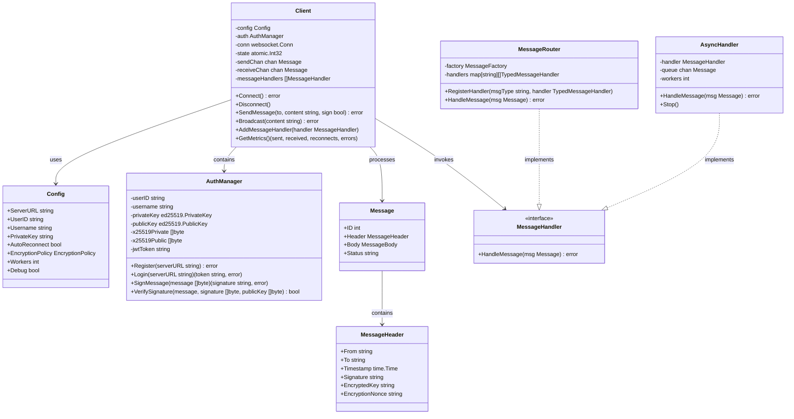
```mermaid
classDiagram
    class Client {
        -config Config
        -auth AuthManager
        -conn websocket.Conn
        -state atomic.Int32
        -sendChan chan Message
        -receiveChan chan Message
        -messageHandlers []MessageHandler
        +Connect() error
        +Disconnect()
        +SendMessage(to, content string, sign bool) error
        +Broadcast(content string) error
        +AddMessageHandler(handler MessageHandler)
        +GetMetrics() (sent, received, reconnects, errors)
    }

    class Config {
        +ServerURL string
        +UserID string
        +Username string
        +PrivateKey string
        +AutoReconnect bool
        +EncryptionPolicy EncryptionPolicy
        +Workers int
        +Debug bool
    }

    class AuthManager {
        -userID string
        -username string
        -privateKey ed25519.PrivateKey
        -publicKey ed25519.PublicKey
        -x25519Private []byte
        -x25519Public []byte
        -jwtToken string
        +Register(serverURL string) error
        +Login(serverURL string) (token string, error)
        +SignMessage(message []byte) (signature string, error)
        +VerifySignature(message, signature []byte, publicKey []byte) bool
    }

    class Message {
        +ID int
        +Header MessageHeader
        +Body MessageBody
        +Status string
    }

    class MessageHeader {
        +From string
        +To string
        +Timestamp time.Time
        +Signature string
        +EncryptedKey string
        +EncryptionNonce string
    }

    class MessageHandler {
        <<interface>>
        +HandleMessage(msg Message) error
    }

    class MessageRouter {
        -factory MessageFactory
        -handlers map[string][]TypedMessageHandler
        +RegisterHandler(msgType string, handler TypedMessageHandler)
        +HandleMessage(msg Message) error
    }

    class AsyncHandler {
        -handler MessageHandler
        -queue chan Message
        -workers int
        +HandleMessage(msg Message) error
        +Stop()
    }

    Client --> Config : uses
    Client --> AuthManager : contains
    Client --> Message : processes
    Client --> MessageHandler : invokes
    
    MessageRouter ..|> MessageHandler : implements
    AsyncHandler ..|> MessageHandler : implements
    
    Message --> MessageHeader : contains
```

## Connection Management

### Connection State Machine

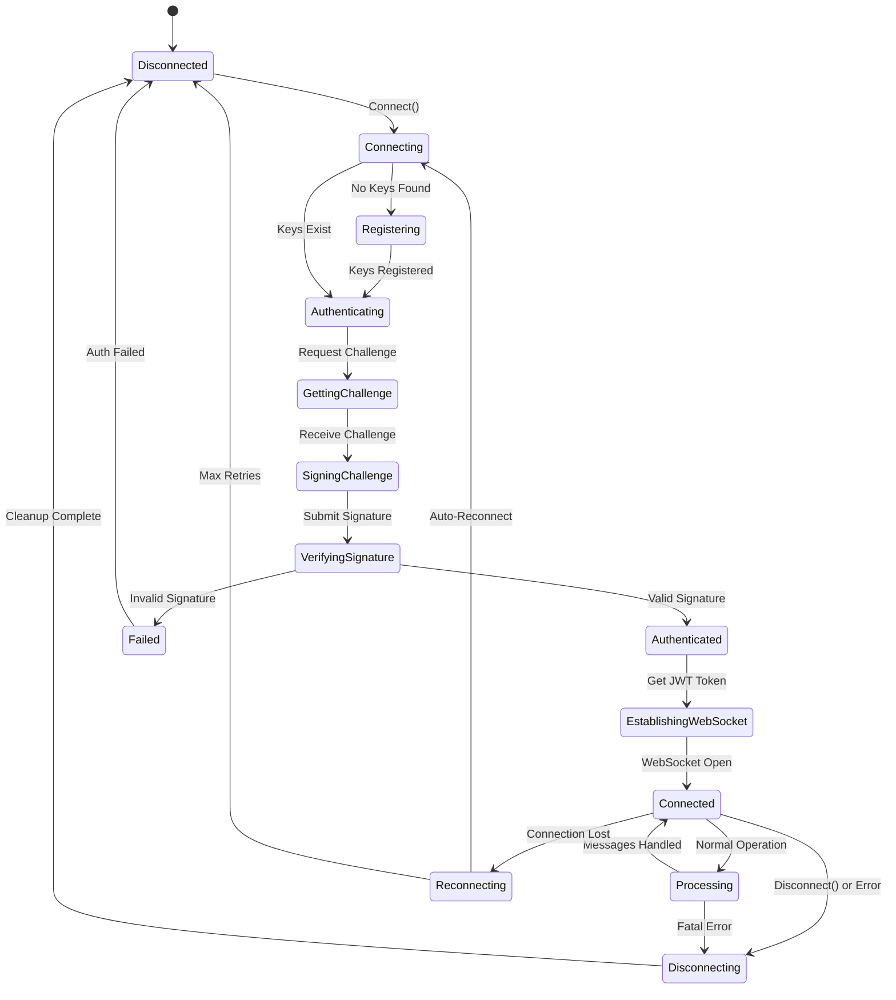
```mermaid
stateDiagram-v2
    [*] --> Disconnected
    
    Disconnected --> Connecting : Connect()
    
    Connecting --> Registering : No Keys Found
    Registering --> Authenticating : Keys Registered
    
    Connecting --> Authenticating : Keys Exist
    
    Authenticating --> GettingChallenge : Request Challenge
    GettingChallenge --> SigningChallenge : Receive Challenge
    SigningChallenge --> VerifyingSignature : Submit Signature
    VerifyingSignature --> Authenticated : Valid Signature
    
    Authenticated --> EstablishingWebSocket : Get JWT Token
    EstablishingWebSocket --> Connected : WebSocket Open
    
    Connected --> Processing : Normal Operation
    Processing --> Connected : Messages Handled
    
    Connected --> Disconnecting : Disconnect() or Error
    Processing --> Disconnecting : Fatal Error
    
    Disconnecting --> Disconnected : Cleanup Complete
    
    Connected --> Reconnecting : Connection Lost
    Reconnecting --> Connecting : Auto-Reconnect
    Reconnecting --> Disconnected : Max Retries
    
    VerifyingSignature --> Failed : Invalid Signature
    Failed --> Disconnected : Auth Failed
```

### Reconnection Strategy

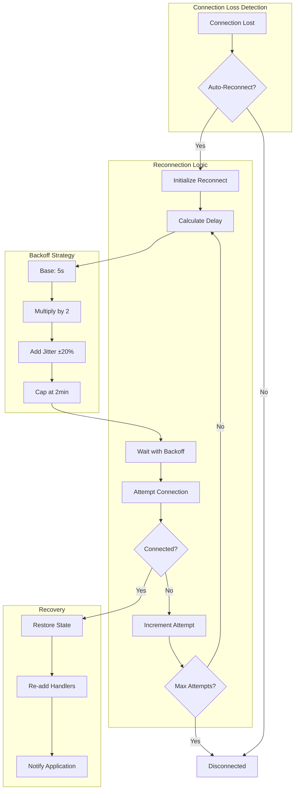
```mermaid
flowchart TB
    subgraph "Connection Loss Detection"
        DETECT[Connection Lost]
        CHECK{Auto-Reconnect?}
    end

    subgraph "Reconnection Logic"
        INIT[Initialize Reconnect]
        CALC[Calculate Delay]
        WAIT[Wait with Backoff]
        ATTEMPT[Attempt Connection]
        SUCCESS{Connected?}
        INCREMENT[Increment Attempt]
        MAX{Max Attempts?}
    end

    subgraph "Backoff Strategy"
        BASE[Base: 5s]
        MULTIPLY[Multiply by 2]
        JITTER[Add Jitter ±20%]
        CAP[Cap at 2min]
    end

    subgraph "Recovery"
        RESTORE[Restore State]
        RESUBSCRIBE[Re-add Handlers]
        NOTIFY[Notify Application]
    end

    DETECT --> CHECK
    CHECK -->|Yes| INIT
    CHECK -->|No| END[Disconnected]
    
    INIT --> CALC
    CALC --> BASE
    BASE --> MULTIPLY
    MULTIPLY --> JITTER
    JITTER --> CAP
    CAP --> WAIT
    
    WAIT --> ATTEMPT
    ATTEMPT --> SUCCESS
    SUCCESS -->|Yes| RESTORE
    SUCCESS -->|No| INCREMENT
    
    INCREMENT --> MAX
    MAX -->|No| CALC
    MAX -->|Yes| END
    
    RESTORE --> RESUBSCRIBE
    RESUBSCRIBE --> NOTIFY
```

## Message Processing Pipeline

### Message Flow Architecture

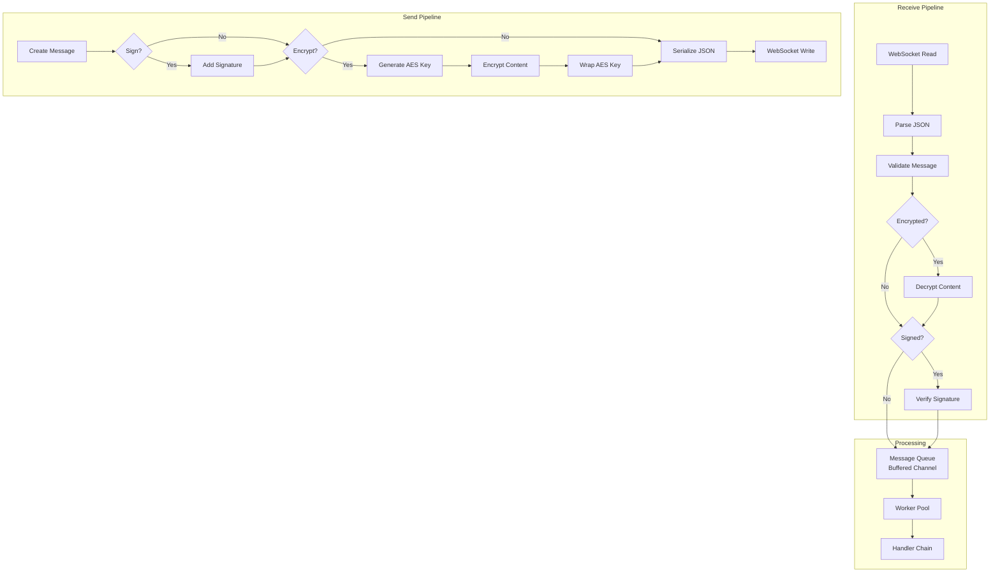
```mermaid
flowchart TB
    subgraph "Receive Pipeline"
        WS_READ[WebSocket Read]
        PARSE[Parse JSON]
        VALIDATE[Validate Message]
        DECRYPT{Encrypted?}
        DECRYPT_AES[Decrypt Content]
        VERIFY{Signed?}
        VERIFY_SIG[Verify Signature]
    end

    subgraph "Processing"
        QUEUE[Message Queue<br/>Buffered Channel]
        WORKERS[Worker Pool]
        HANDLERS[Handler Chain]
    end

    subgraph "Send Pipeline"
        CREATE[Create Message]
        SIGN{Sign?}
        SIGN_MSG[Add Signature]
        ENCRYPT{Encrypt?}
        GEN_KEY[Generate AES Key]
        ENCRYPT_MSG[Encrypt Content]
        WRAP_KEY[Wrap AES Key]
        SERIALIZE[Serialize JSON]
        WS_WRITE[WebSocket Write]
    end

    WS_READ --> PARSE
    PARSE --> VALIDATE
    VALIDATE --> DECRYPT
    DECRYPT -->|Yes| DECRYPT_AES
    DECRYPT -->|No| VERIFY
    DECRYPT_AES --> VERIFY
    VERIFY -->|Yes| VERIFY_SIG
    VERIFY -->|No| QUEUE
    VERIFY_SIG --> QUEUE
    
    QUEUE --> WORKERS
    WORKERS --> HANDLERS
    
    CREATE --> SIGN
    SIGN -->|Yes| SIGN_MSG
    SIGN -->|No| ENCRYPT
    SIGN_MSG --> ENCRYPT
    ENCRYPT -->|Yes| GEN_KEY
    ENCRYPT -->|No| SERIALIZE
    GEN_KEY --> ENCRYPT_MSG
    ENCRYPT_MSG --> WRAP_KEY
    WRAP_KEY --> SERIALIZE
    SERIALIZE --> WS_WRITE
```

### Concurrent Processing Model

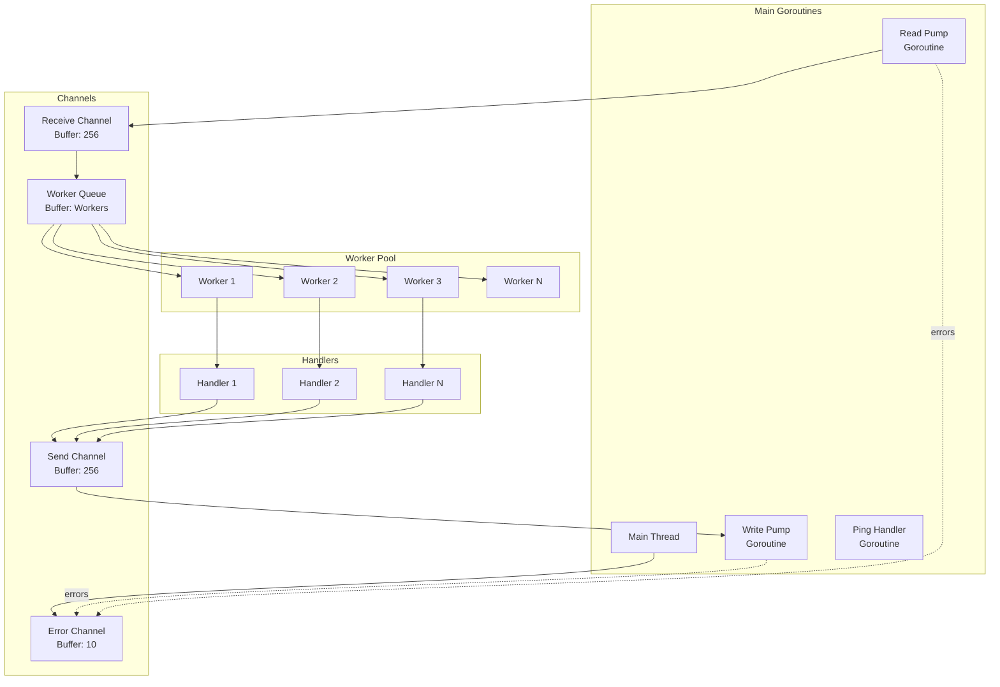
```mermaid
graph TB
    subgraph "Main Goroutines"
        MAIN[Main Thread]
        READ[Read Pump<br/>Goroutine]
        WRITE[Write Pump<br/>Goroutine]
        PING[Ping Handler<br/>Goroutine]
    end

    subgraph "Worker Pool"
        W1[Worker 1]
        W2[Worker 2]
        W3[Worker 3]
        WN[Worker N]
    end

    subgraph "Channels"
        RECV[Receive Channel<br/>Buffer: 256]
        SEND[Send Channel<br/>Buffer: 256]
        ERROR[Error Channel<br/>Buffer: 10]
        WORKER_Q[Worker Queue<br/>Buffer: Workers]
    end

    subgraph "Handlers"
        H1[Handler 1]
        H2[Handler 2]
        H3[Handler N]
    end

    READ --> RECV
    RECV --> WORKER_Q
    
    WORKER_Q --> W1
    WORKER_Q --> W2
    WORKER_Q --> W3
    WORKER_Q --> WN
    
    W1 --> H1
    W2 --> H2
    W3 --> H3
    
    H1 --> SEND
    H2 --> SEND
    H3 --> SEND
    
    SEND --> WRITE
    
    MAIN --> ERROR
    READ -.->|errors| ERROR
    WRITE -.->|errors| ERROR
```

## Encryption Architecture

### Hybrid Encryption System

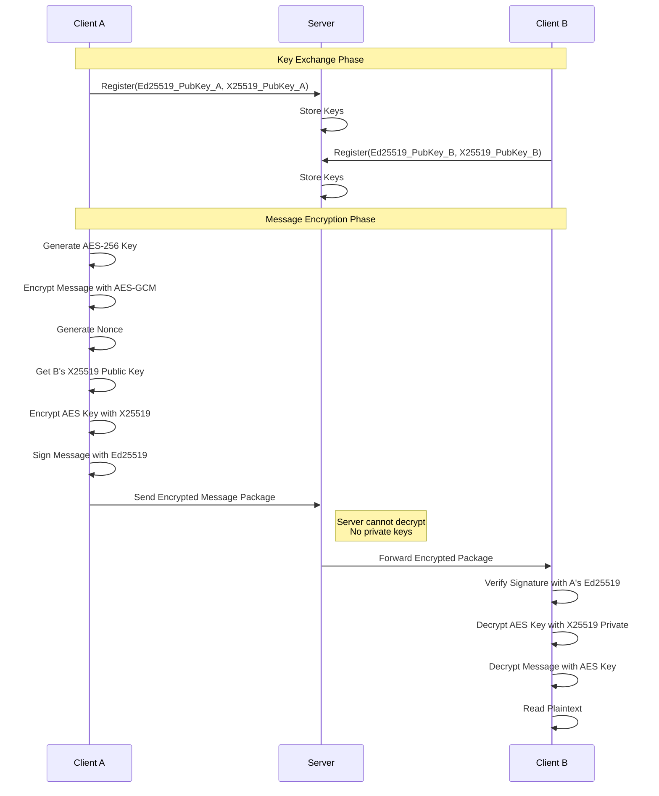
```mermaid
sequenceDiagram
    participant A as Client A
    participant S as Server
    participant B as Client B

    Note over A,B: Key Exchange Phase
    
    A->>S: Register(Ed25519_PubKey_A, X25519_PubKey_A)
    S->>S: Store Keys
    B->>S: Register(Ed25519_PubKey_B, X25519_PubKey_B)
    S->>S: Store Keys

    Note over A,B: Message Encryption Phase
    
    A->>A: Generate AES-256 Key
    A->>A: Encrypt Message with AES-GCM
    A->>A: Generate Nonce
    A->>A: Get B's X25519 Public Key
    A->>A: Encrypt AES Key with X25519
    A->>A: Sign Message with Ed25519
    
    A->>S: Send Encrypted Message Package
    Note right of S: Server cannot decrypt<br/>No private keys
    
    S->>B: Forward Encrypted Package
    
    B->>B: Verify Signature with A's Ed25519
    B->>B: Decrypt AES Key with X25519 Private
    B->>B: Decrypt Message with AES Key
    B->>B: Read Plaintext
```

### Key Derivation and Management

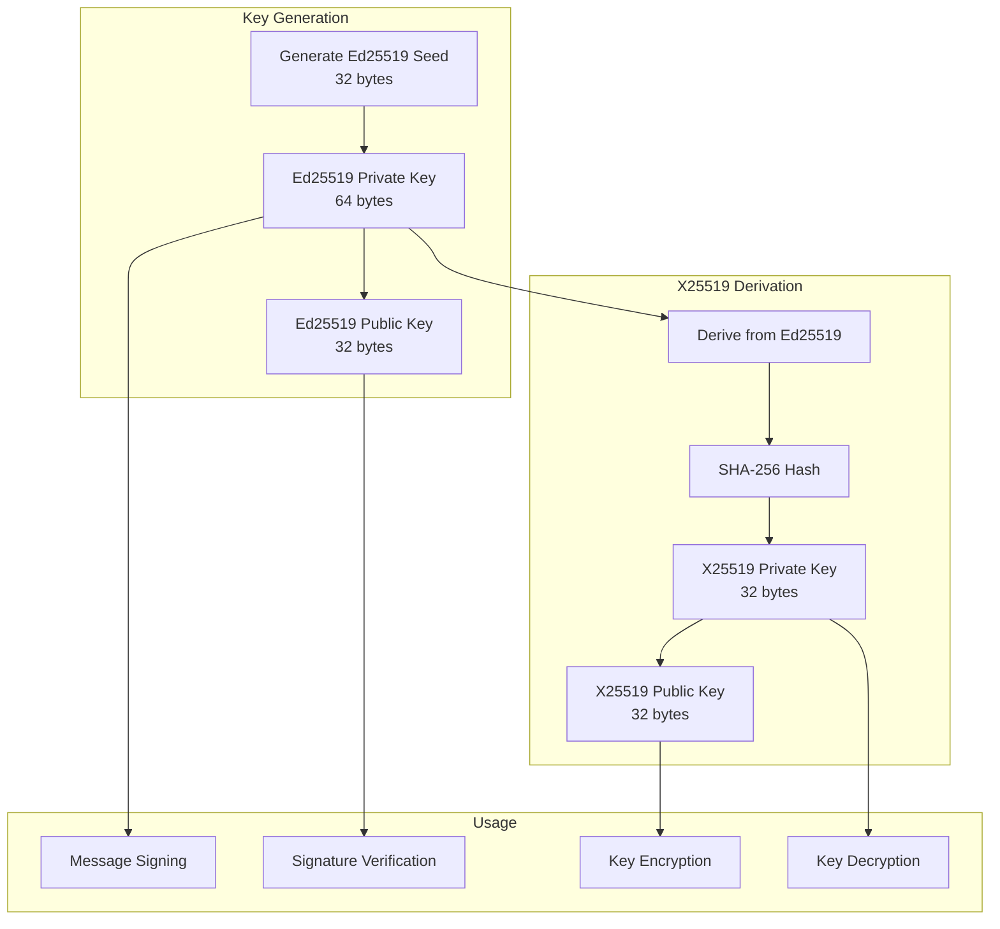
```mermaid
graph TB
    subgraph "Key Generation"
        SEED[Generate Ed25519 Seed<br/>32 bytes]
        ED_PRIV[Ed25519 Private Key<br/>64 bytes]
        ED_PUB[Ed25519 Public Key<br/>32 bytes]
    end

    subgraph "X25519 Derivation"
        DERIVE[Derive from Ed25519]
        HASH[SHA-256 Hash]
        X_PRIV[X25519 Private Key<br/>32 bytes]
        X_PUB[X25519 Public Key<br/>32 bytes]
    end

    subgraph "Usage"
        SIGN[Message Signing]
        VERIFY[Signature Verification]
        ENCRYPT[Key Encryption]
        DECRYPT[Key Decryption]
    end

    SEED --> ED_PRIV
    ED_PRIV --> ED_PUB
    
    ED_PRIV --> DERIVE
    DERIVE --> HASH
    HASH --> X_PRIV
    X_PRIV --> X_PUB
    
    ED_PRIV --> SIGN
    ED_PUB --> VERIFY
    
    X_PUB --> ENCRYPT
    X_PRIV --> DECRYPT
```

## Handler System

### Handler Architecture

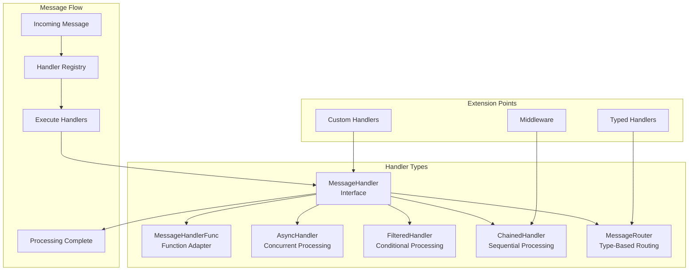
```mermaid
graph TB
    subgraph "Handler Types"
        BASE[MessageHandler<br/>Interface]
        FUNC[MessageHandlerFunc<br/>Function Adapter]
        ASYNC[AsyncHandler<br/>Concurrent Processing]
        FILTER[FilteredHandler<br/>Conditional Processing]
        CHAIN[ChainedHandler<br/>Sequential Processing]
        ROUTER[MessageRouter<br/>Type-Based Routing]
    end

    subgraph "Message Flow"
        MSG[Incoming Message]
        REGISTRY[Handler Registry]
        EXECUTE[Execute Handlers]
        RESULT[Processing Complete]
    end

    subgraph "Extension Points"
        CUSTOM[Custom Handlers]
        TYPED[Typed Handlers]
        MIDDLEWARE[Middleware]
    end

    BASE --> FUNC
    BASE --> ASYNC
    BASE --> FILTER
    BASE --> CHAIN
    BASE --> ROUTER
    
    MSG --> REGISTRY
    REGISTRY --> EXECUTE
    
    EXECUTE --> BASE
    BASE --> RESULT
    
    CUSTOM --> BASE
    TYPED --> ROUTER
    MIDDLEWARE --> CHAIN
```

### Handler Execution Patterns

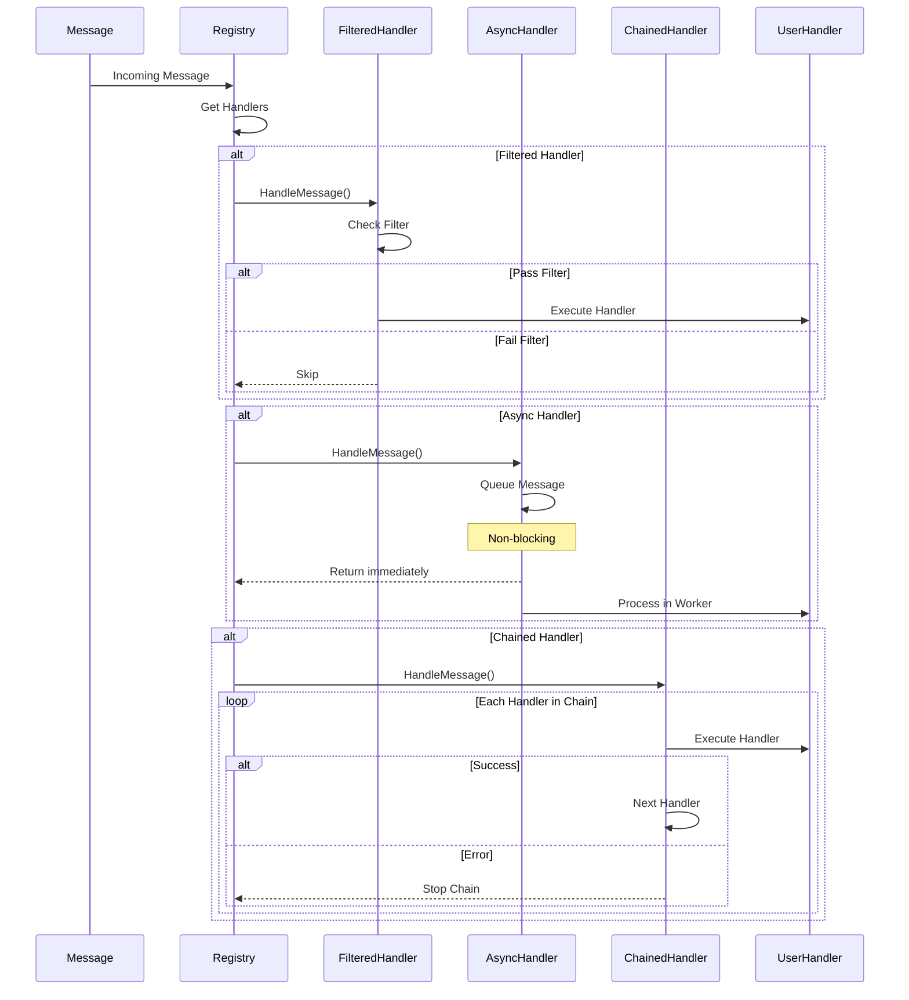
```mermaid
sequenceDiagram
    participant M as Message
    participant R as Registry
    participant F as FilteredHandler
    participant A as AsyncHandler
    participant C as ChainedHandler
    participant H as UserHandler

    M->>R: Incoming Message
    R->>R: Get Handlers
    
    alt Filtered Handler
        R->>F: HandleMessage()
        F->>F: Check Filter
        alt Pass Filter
            F->>H: Execute Handler
        else Fail Filter
            F-->>R: Skip
        end
    end

    alt Async Handler
        R->>A: HandleMessage()
        A->>A: Queue Message
        Note over A: Non-blocking
        A-->>R: Return immediately
        A->>H: Process in Worker
    end

    alt Chained Handler
        R->>C: HandleMessage()
        loop Each Handler in Chain
            C->>H: Execute Handler
            alt Success
                C->>C: Next Handler
            else Error
                C-->>R: Stop Chain
            end
        end
    end
```

## Extension Architecture

### Message Router System

```mermaid
classDiagram
    class MessageFactory {
        <<interface>>
        +CreateMessage(msgType) ExtendedMessage
        +RegisterType(msgType, example)
        +ParseMessage(data) ExtendedMessage
    }

    class DefaultMessageFactory {
        -types map[string]reflect.Type
        +CreateMessage(msgType) ExtendedMessage
        +RegisterType(msgType, example)
        +ParseMessage(data) ExtendedMessage
    }

    class MessageRouter {
        -factory MessageFactory
        -handlers map[string][]TypedMessageHandler
        +SetFactory(factory)
        +RegisterHandler(msgType, handler)
        +HandleMessage(msg) error
    }

    class TypedMessageHandler {
        <<interface>>
        +HandleTypedMessage(msgType, msg) error
        +GetSupportedTypes() []string
    }

    class ExtendedMessage {
        <<interface>>
        +GetType() string
        +GetContent() interface{}
    }

    class CustomMessage {
        +Type string
        +Data interface{}
        +GetType() string
        +GetContent() interface{}
    }

    MessageFactory <|.. DefaultMessageFactory
    MessageRouter --> MessageFactory
    MessageRouter --> TypedMessageHandler
    ExtendedMessage <|.. CustomMessage
    MessageFactory --> ExtendedMessage
```

### Extension Pipeline

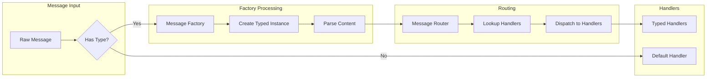
```mermaid
flowchart LR
    subgraph "Message Input"
        RAW[Raw Message]
        TYPE{Has Type?}
    end

    subgraph "Factory Processing"
        FACTORY[Message Factory]
        CREATE[Create Typed Instance]
        PARSE[Parse Content]
    end

    subgraph "Routing"
        ROUTER[Message Router]
        LOOKUP[Lookup Handlers]
        DISPATCH[Dispatch to Handlers]
    end

    subgraph "Handlers"
        TYPED[Typed Handlers]
        FALLBACK[Default Handler]
    end

    RAW --> TYPE
    TYPE -->|Yes| FACTORY
    TYPE -->|No| FALLBACK
    
    FACTORY --> CREATE
    CREATE --> PARSE
    PARSE --> ROUTER
    
    ROUTER --> LOOKUP
    LOOKUP --> DISPATCH
    DISPATCH --> TYPED
```

## Concurrency Model

### Goroutine Architecture

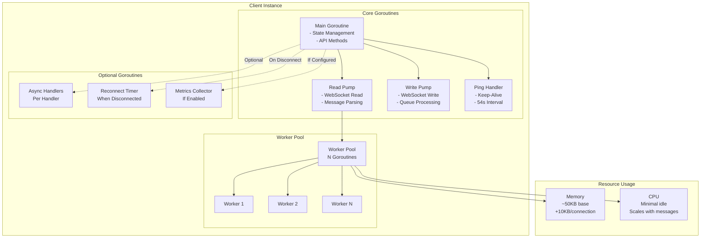
```mermaid
graph TB
    subgraph "Client Instance"
        subgraph "Core Goroutines"
            MAIN[Main Goroutine<br/>- State Management<br/>- API Methods]
            READ[Read Pump<br/>- WebSocket Read<br/>- Message Parsing]
            WRITE[Write Pump<br/>- WebSocket Write<br/>- Queue Processing]
            PING[Ping Handler<br/>- Keep-Alive<br/>- 54s Interval]
        end

        subgraph "Worker Pool"
            POOL[Worker Pool<br/>N Goroutines]
            W1[Worker 1]
            W2[Worker 2]
            WN[Worker N]
        end

        subgraph "Optional Goroutines"
            ASYNC[Async Handlers<br/>Per Handler]
            RECONN[Reconnect Timer<br/>When Disconnected]
            METRICS[Metrics Collector<br/>If Enabled]
        end
    end

    subgraph "Resource Usage"
        MEM[Memory<br/>~50KB base<br/>+10KB/connection]
        CPU[CPU<br/>Minimal idle<br/>Scales with messages]
    end

    MAIN --> READ
    MAIN --> WRITE
    MAIN --> PING
    
    READ --> POOL
    POOL --> W1
    POOL --> W2
    POOL --> WN
    
    MAIN -.->|Optional| ASYNC
    MAIN -.->|On Disconnect| RECONN
    MAIN -.->|If Configured| METRICS
    
    POOL --> MEM
    POOL --> CPU
```

### Synchronization Primitives

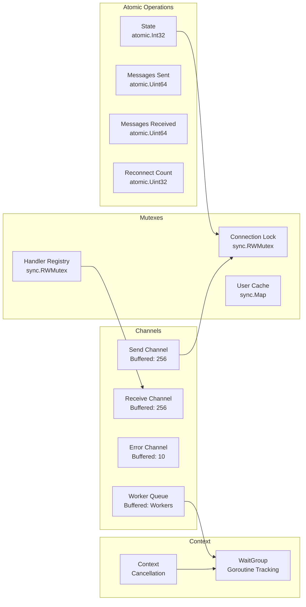
```mermaid
graph LR
    subgraph "Atomic Operations"
        STATE[State<br/>atomic.Int32]
        SENT[Messages Sent<br/>atomic.Uint64]
        RECV[Messages Received<br/>atomic.Uint64]
        RECONN[Reconnect Count<br/>atomic.Uint32]
    end

    subgraph "Mutexes"
        CONN_LOCK[Connection Lock<br/>sync.RWMutex]
        HANDLER_LOCK[Handler Registry<br/>sync.RWMutex]
        CACHE_LOCK[User Cache<br/>sync.Map]
    end

    subgraph "Channels"
        SEND_CH[Send Channel<br/>Buffered: 256]
        RECV_CH[Receive Channel<br/>Buffered: 256]
        ERROR_CH[Error Channel<br/>Buffered: 10]
        WORKER_CH[Worker Queue<br/>Buffered: Workers]
    end

    subgraph "Context"
        CTX[Context<br/>Cancellation]
        WG[WaitGroup<br/>Goroutine Tracking]
    end

    STATE --> CONN_LOCK
    HANDLER_LOCK --> RECV_CH
    SEND_CH --> CONN_LOCK
    WORKER_CH --> WG
    CTX --> WG
```

## Error Handling & Recovery

### Error Handling Flow

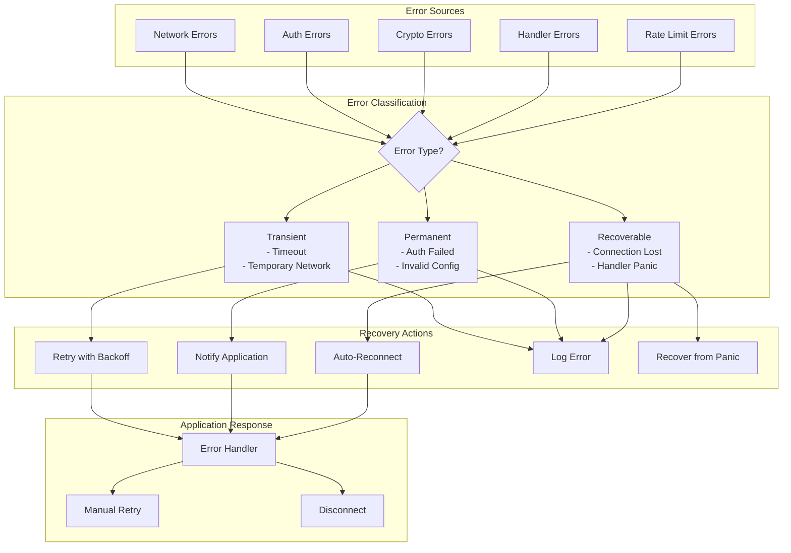
```mermaid
flowchart TB
    subgraph "Error Sources"
        NET[Network Errors]
        AUTH[Auth Errors]
        CRYPTO[Crypto Errors]
        HANDLER[Handler Errors]
        RATE[Rate Limit Errors]
    end

    subgraph "Error Classification"
        CLASSIFY{Error Type?}
        TRANSIENT[Transient<br/>- Timeout<br/>- Temporary Network]
        PERMANENT[Permanent<br/>- Auth Failed<br/>- Invalid Config]
        RECOVERABLE[Recoverable<br/>- Connection Lost<br/>- Handler Panic]
    end

    subgraph "Recovery Actions"
        RETRY[Retry with Backoff]
        RECONNECT[Auto-Reconnect]
        NOTIFY[Notify Application]
        LOG[Log Error]
        PANIC_RECOVER[Recover from Panic]
    end

    subgraph "Application Response"
        APP_HANDLER[Error Handler]
        APP_RETRY[Manual Retry]
        APP_DISCONNECT[Disconnect]
    end

    NET --> CLASSIFY
    AUTH --> CLASSIFY
    CRYPTO --> CLASSIFY
    HANDLER --> CLASSIFY
    RATE --> CLASSIFY
    
    CLASSIFY --> TRANSIENT
    CLASSIFY --> PERMANENT
    CLASSIFY --> RECOVERABLE
    
    TRANSIENT --> RETRY
    TRANSIENT --> LOG
    
    PERMANENT --> NOTIFY
    PERMANENT --> LOG
    
    RECOVERABLE --> RECONNECT
    RECOVERABLE --> PANIC_RECOVER
    RECOVERABLE --> LOG
    
    RETRY --> APP_HANDLER
    NOTIFY --> APP_HANDLER
    RECONNECT --> APP_HANDLER
    
    APP_HANDLER --> APP_RETRY
    APP_HANDLER --> APP_DISCONNECT
```

### Panic Recovery Architecture

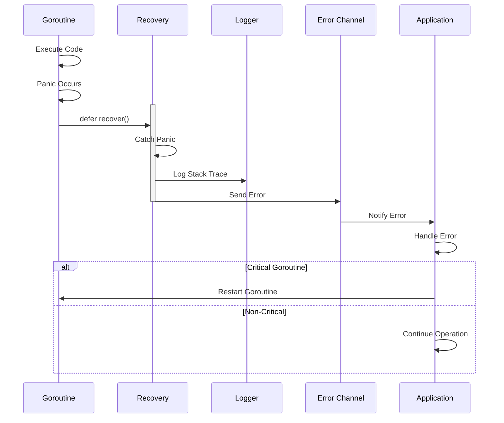
```mermaid
sequenceDiagram
    participant G as Goroutine
    participant R as Recovery
    participant L as Logger
    participant E as Error Channel
    participant A as Application

    G->>G: Execute Code
    G->>G: Panic Occurs
    
    activate R
    G->>R: defer recover()
    R->>R: Catch Panic
    R->>L: Log Stack Trace
    R->>E: Send Error
    deactivate R
    
    E->>A: Notify Error
    A->>A: Handle Error
    
    alt Critical Goroutine
        A->>G: Restart Goroutine
    else Non-Critical
        A->>A: Continue Operation
    end
```

## Performance Optimization

### Message Processing Optimization

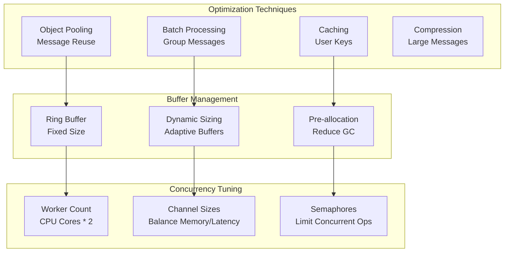
```mermaid
graph TB
    subgraph "Optimization Techniques"
        POOL[Object Pooling<br/>Message Reuse]
        BATCH[Batch Processing<br/>Group Messages]
        CACHE[Caching<br/>User Keys]
        COMPRESS[Compression<br/>Large Messages]
    end

    subgraph "Buffer Management"
        RING[Ring Buffer<br/>Fixed Size]
        DYNAMIC[Dynamic Sizing<br/>Adaptive Buffers]
        PREALLOC[Pre-allocation<br/>Reduce GC]
    end

    subgraph "Concurrency Tuning"
        WORKERS[Worker Count<br/>CPU Cores * 2]
        CHANNELS[Channel Sizes<br/>Balance Memory/Latency]
        SEMAPHORE[Semaphores<br/>Limit Concurrent Ops]
    end

    POOL --> RING
    BATCH --> DYNAMIC
    CACHE --> PREALLOC
    
    RING --> WORKERS
    DYNAMIC --> CHANNELS
    PREALLOC --> SEMAPHORE
```

## Testing Architecture

### Test Coverage Strategy

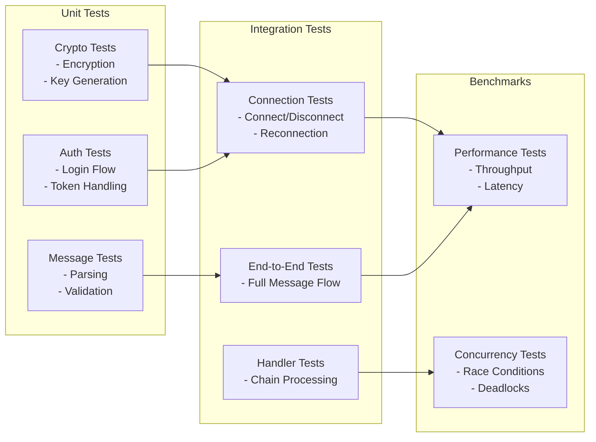
```mermaid
graph LR
    subgraph "Unit Tests"
        CRYPTO_TEST[Crypto Tests<br/>- Encryption<br/>- Key Generation]
        AUTH_TEST[Auth Tests<br/>- Login Flow<br/>- Token Handling]
        MSG_TEST[Message Tests<br/>- Parsing<br/>- Validation]
    end

    subgraph "Integration Tests"
        CONN_TEST[Connection Tests<br/>- Connect/Disconnect<br/>- Reconnection]
        E2E_TEST[End-to-End Tests<br/>- Full Message Flow]
        HANDLER_TEST[Handler Tests<br/>- Chain Processing]
    end

    subgraph "Benchmarks"
        PERF_TEST[Performance Tests<br/>- Throughput<br/>- Latency]
        CONC_TEST[Concurrency Tests<br/>- Race Conditions<br/>- Deadlocks]
    end

    CRYPTO_TEST --> CONN_TEST
    AUTH_TEST --> CONN_TEST
    MSG_TEST --> E2E_TEST
    
    CONN_TEST --> PERF_TEST
    E2E_TEST --> PERF_TEST
    HANDLER_TEST --> CONC_TEST
```

## Deployment Patterns

### Container Architecture

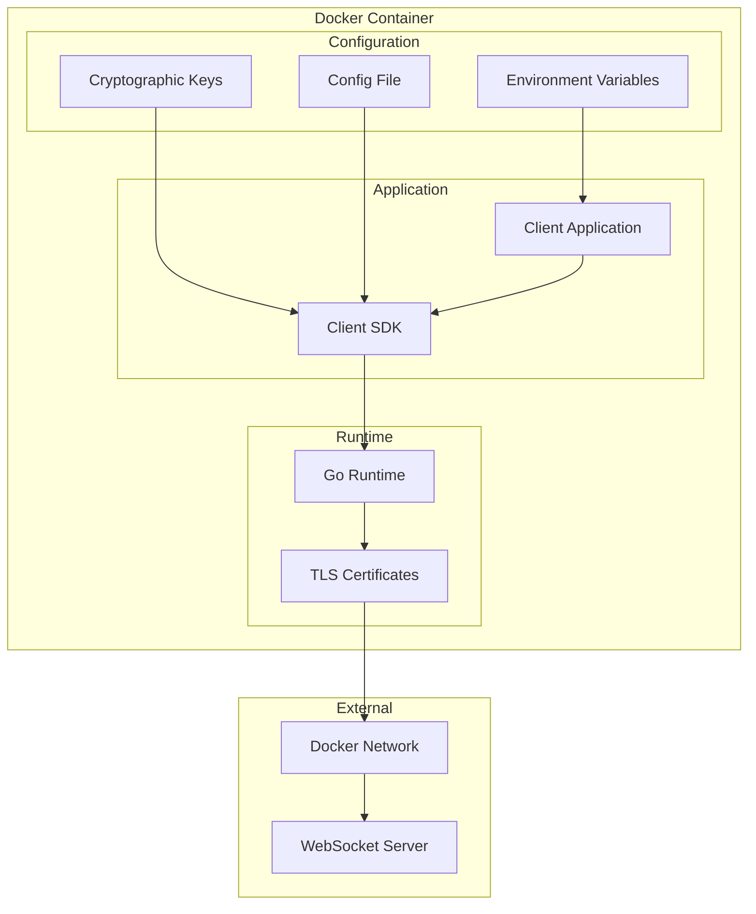
```mermaid
graph TB
    subgraph "Docker Container"
        subgraph "Application"
            APP[Client Application]
            SDK[Client SDK]
        end

        subgraph "Configuration"
            ENV[Environment Variables]
            KEYS[Cryptographic Keys]
            CONFIG[Config File]
        end

        subgraph "Runtime"
            GO[Go Runtime]
            TLS[TLS Certificates]
        end
    end

    subgraph "External"
        SERVER[WebSocket Server]
        NETWORK[Docker Network]
    end

    ENV --> APP
    KEYS --> SDK
    CONFIG --> SDK
    
    APP --> SDK
    SDK --> GO
    
    GO --> TLS
    TLS --> NETWORK
    NETWORK --> SERVER
```

---

## Summary

The Client SDK architecture is designed for:

1. **High Performance**: Concurrent message processing with worker pools and optimized buffering
2. **Security**: End-to-end encryption with hybrid cryptography (Ed25519 + X25519 + AES)
3. **Reliability**: Automatic reconnection with exponential backoff and comprehensive error recovery
4. **Extensibility**: Plugin architecture with custom handlers, message types, and routing
5. **Developer Experience**: Simple API with powerful features accessible through configuration
6. **Production Ready**: Battle-tested patterns, comprehensive testing, and monitoring capabilities

The architecture supports thousands of messages per second while maintaining low latency and minimal resource usage, making it suitable for real-time applications ranging from chat systems to IoT device communication.