# WebSocket Server Architecture

## Table of Contents
- [Overview](#overview)
- [System Architecture](#system-architecture)
- [Component Architecture](#component-architecture)
- [Data Flow](#data-flow)
- [Security Architecture](#security-architecture)
- [Database Schema](#database-schema)
- [Message Processing Pipeline](#message-processing-pipeline)
- [Authentication Flow](#authentication-flow)
- [Deployment Architecture](#deployment-architecture)

## Overview

The WebSocket Server is a high-performance, secure real-time communication platform built in Go. It provides end-to-end encryption, authentication, rate limiting, and comprehensive message handling capabilities.

## System Architecture

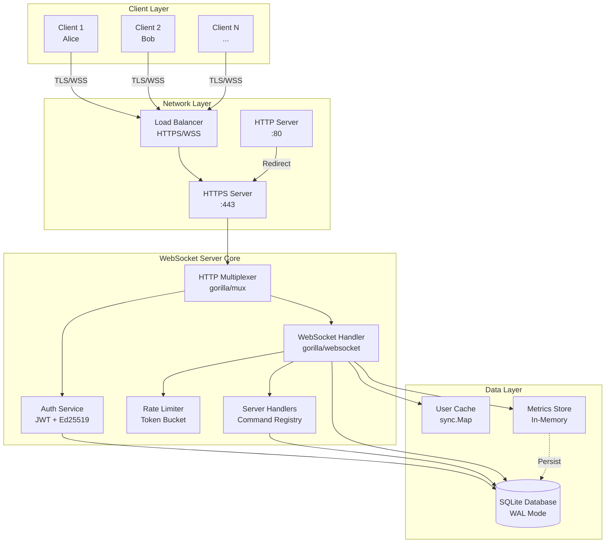

## Component Architecture

### Core Components Dependency Graph

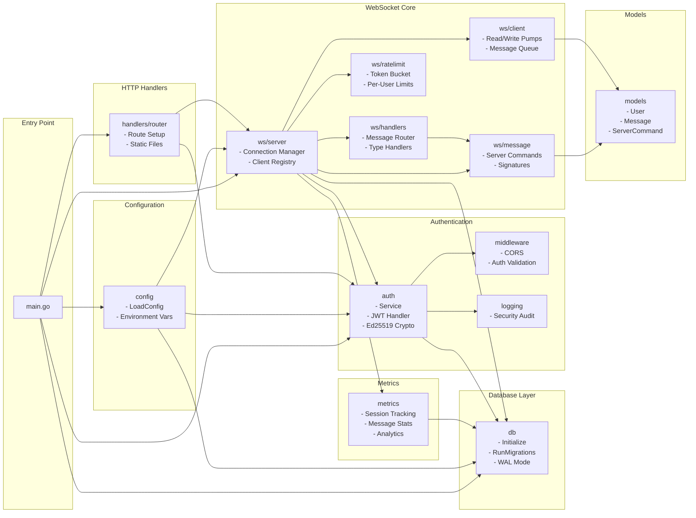

### Detailed Component Interactions

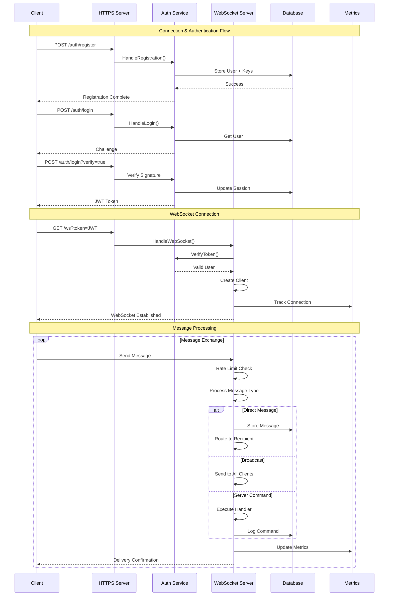

## Data Flow

### Message Processing Pipeline

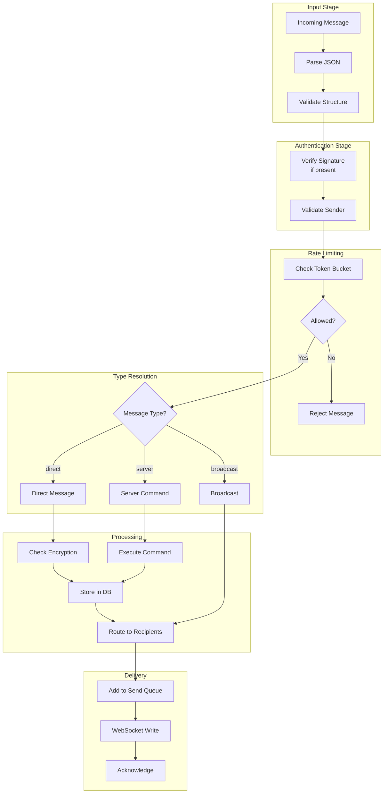

## Security Architecture

### Cryptographic Components

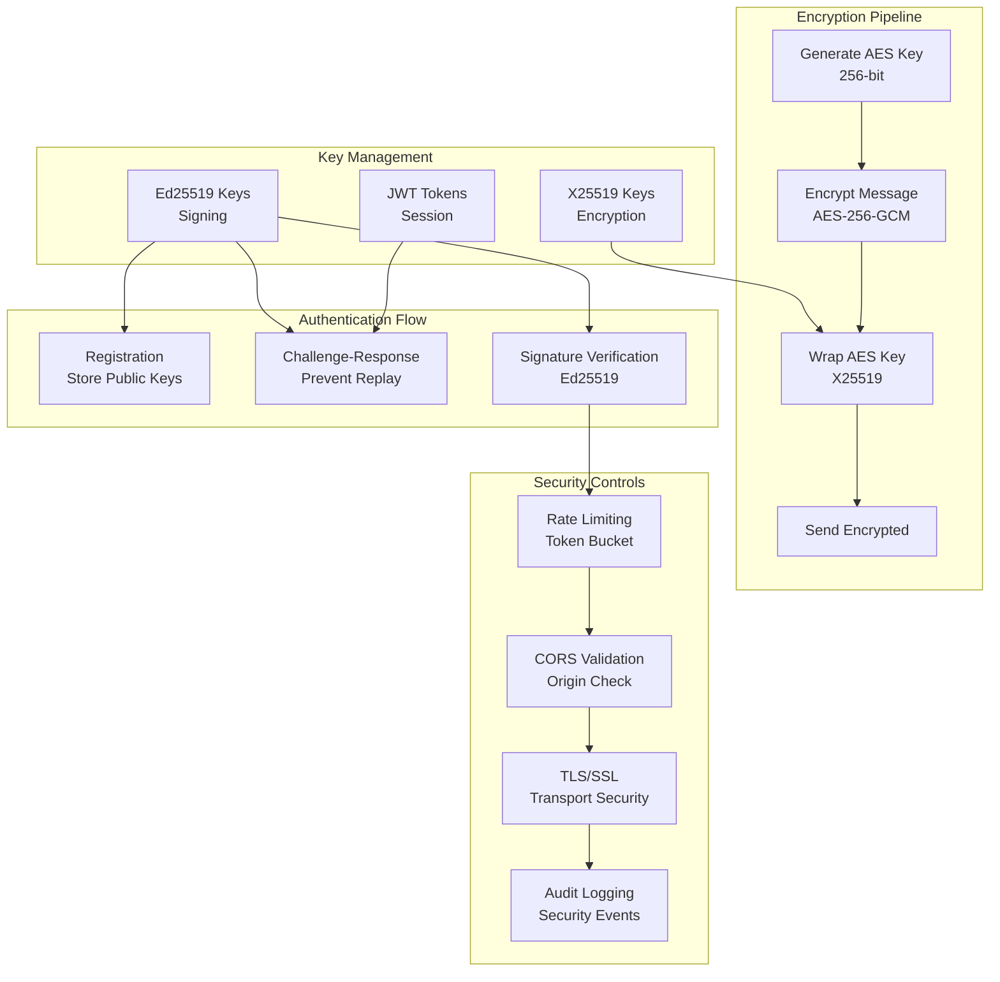

### Zero-Knowledge Architecture

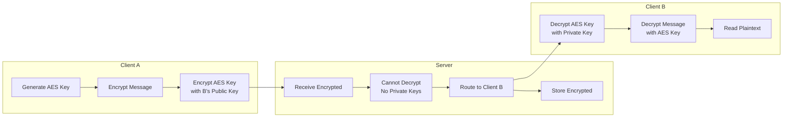

## Database Schema

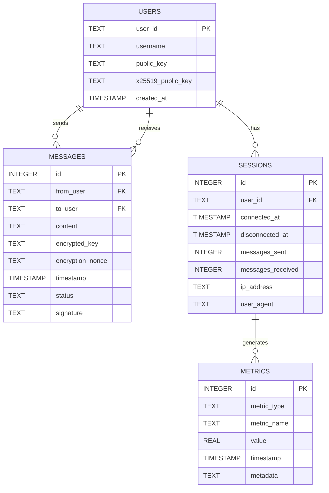

## Message Processing Pipeline

### Server Message Handler Architecture

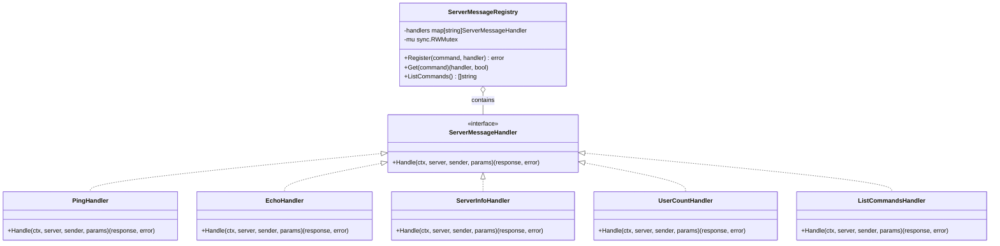

## Authentication Flow

### Challenge-Response Protocol

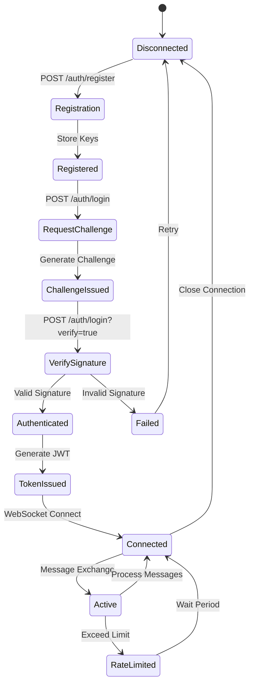

## Deployment Architecture

### Docker Container Architecture

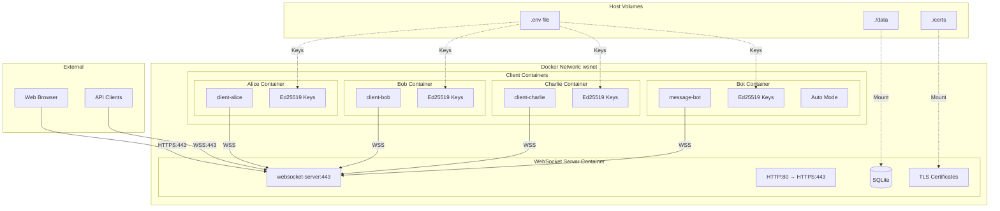

### High Availability Architecture (Future)

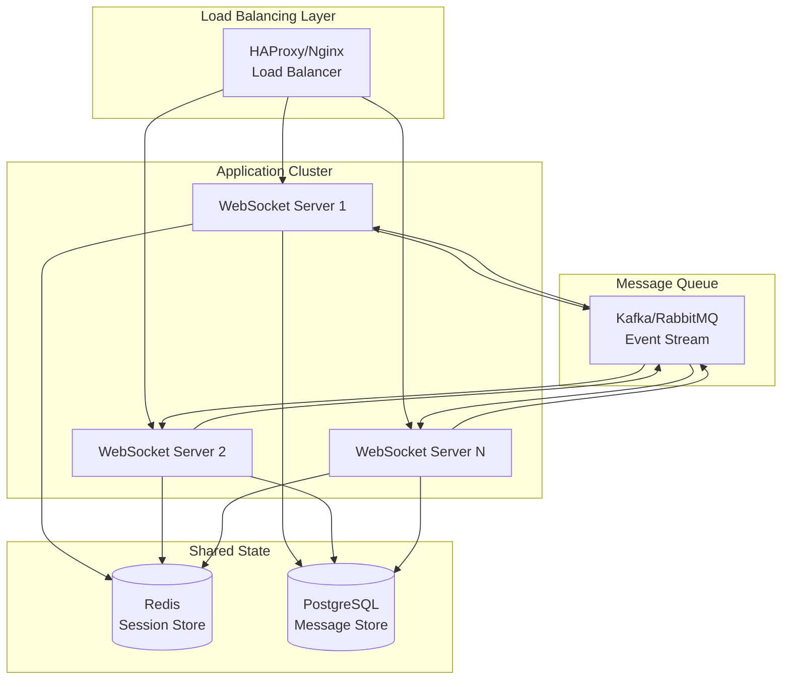

## Performance Characteristics

### Concurrent Connection Handling

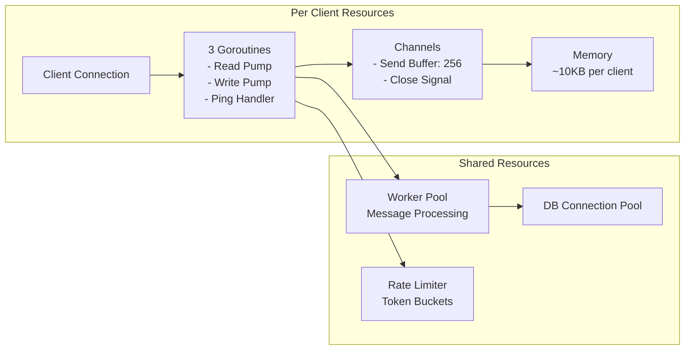

### Message Processing Performance

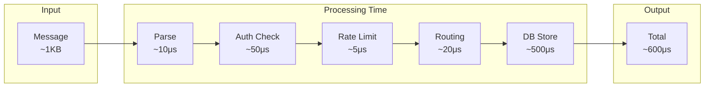

## Monitoring & Observability

### Metrics Collection Pipeline

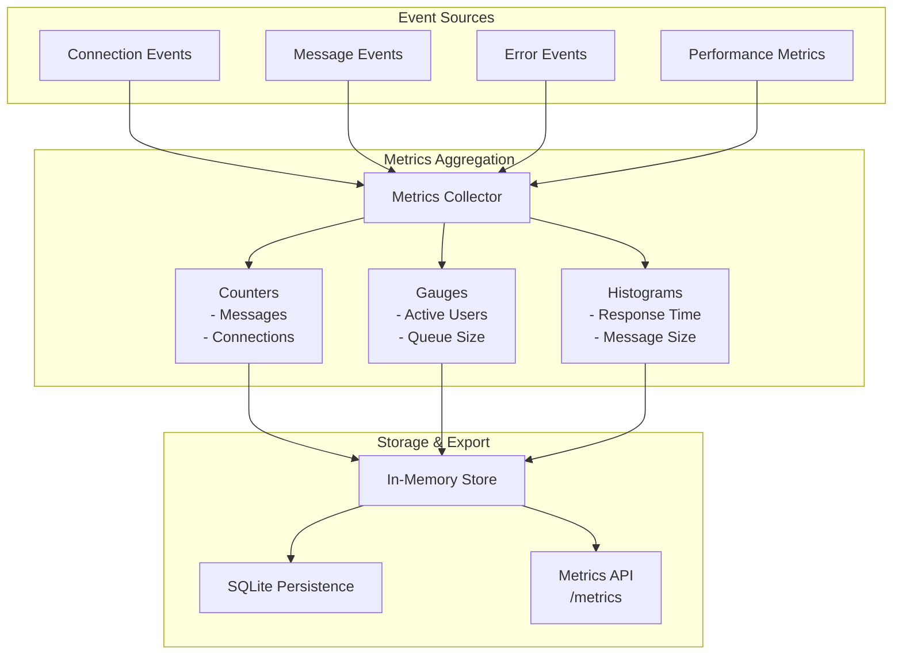

## Error Handling & Recovery

### Error Recovery Flow

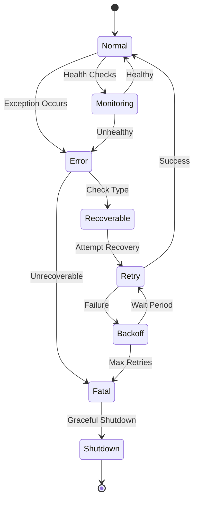

---

## Summary

The WebSocket Server architecture is designed for:

1. **Security First**: Zero-knowledge encryption, signature verification, and comprehensive authentication
2. **Scalability**: Concurrent connection handling with efficient resource usage
3. **Reliability**: Graceful error handling, automatic reconnection support, and message persistence
4. **Performance**: Optimized message routing, rate limiting, and minimal processing overhead
5. **Observability**: Comprehensive metrics, audit logging, and health monitoring
6. **Extensibility**: Plugin-based server commands, modular component design

The architecture supports thousands of concurrent connections while maintaining sub-millisecond message processing times and ensuring end-to-end encryption for sensitive communications.